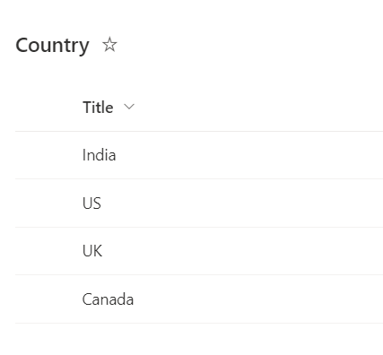
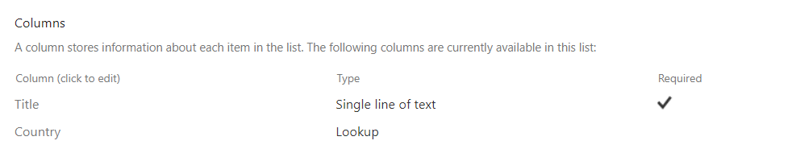
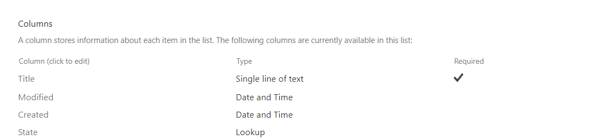
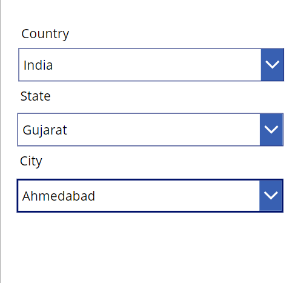

# Quiz app
This example presents a cascading filter that relies on the previously selected value. It involves three SharePoint lists named Country, State, and City. Depending on the chosen country and state, it dynamically filters the dropdown options.

## Country list

## State list

## City list

## App
