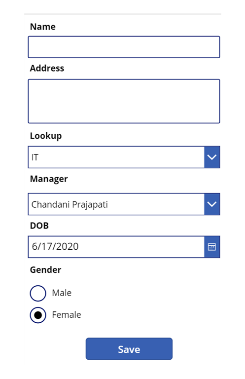

# SharePoint Patch function for all columns
This example illustrates how to utilize the Patch function to create a record in a SharePoint list, incorporating various column types such as user, lookup, and more. For additional information, please refer to [this](https://www.c-sharpcorner.com/article/powerapps-patch-fuction-with-complex-columns/) blog post.

