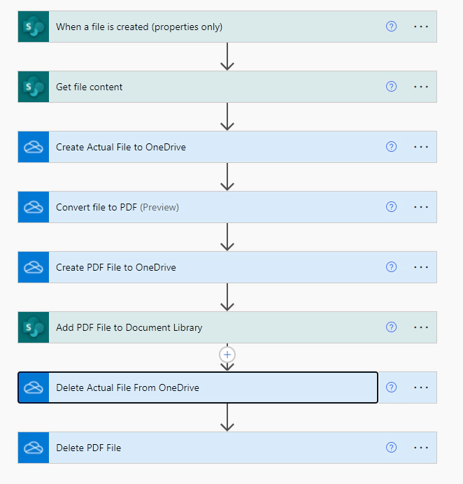
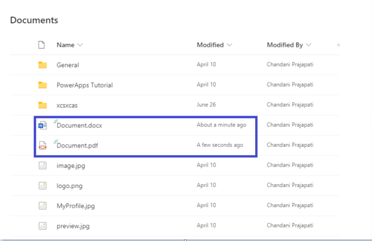

# Convert document to pdf
This example demonstrates the process of converting a SharePoint document file into a PDF format, all without the need for premium connectors. For additional information, please consult this [blog](https://pnp.github.io/blog/post/how-to-convert-word-document-to-pdf-in-sharepoint-document/).

## Flow

## Output

