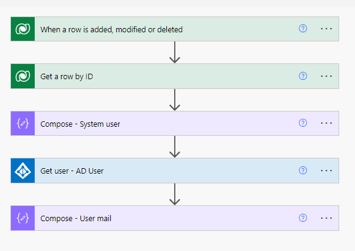
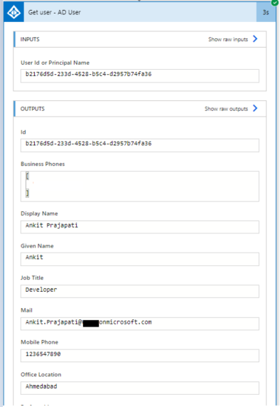

# Get dataverse user details
This example showcases how to utilize the capabilities of Power Automate to access user information from Dataverse. Our main focus will be on extracting valuable data pertaining to both System Users and Active Directory (AD) Users. For more information, you can refer to this[blog](https://www.c-sharpcorner.com/article/retrieve-dataverse-user-details-with-power-automate/).

## Flow

## Output

