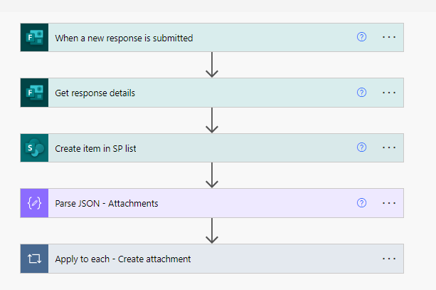

# Save MS forms response to SharePoint list with an attachment
This example illustrates the process of storing a Microsoft Form response in a SharePoint list, including the handling of attachments.

## Flow

